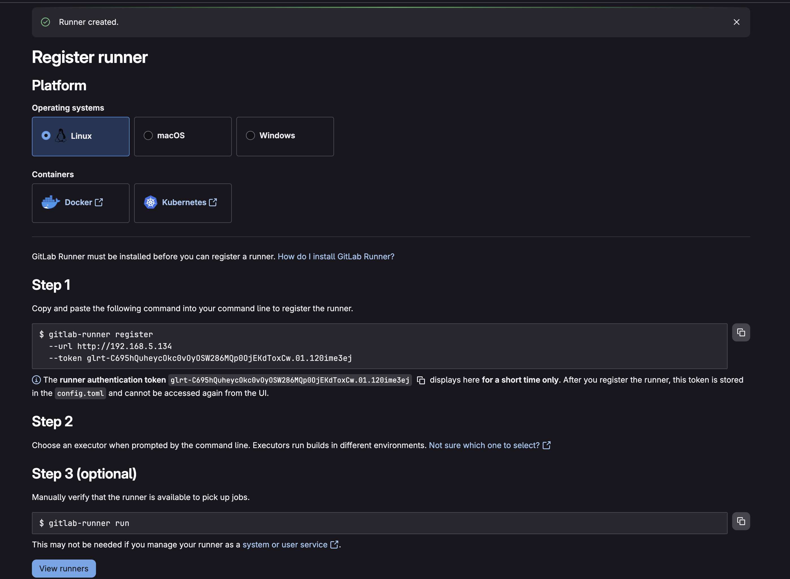
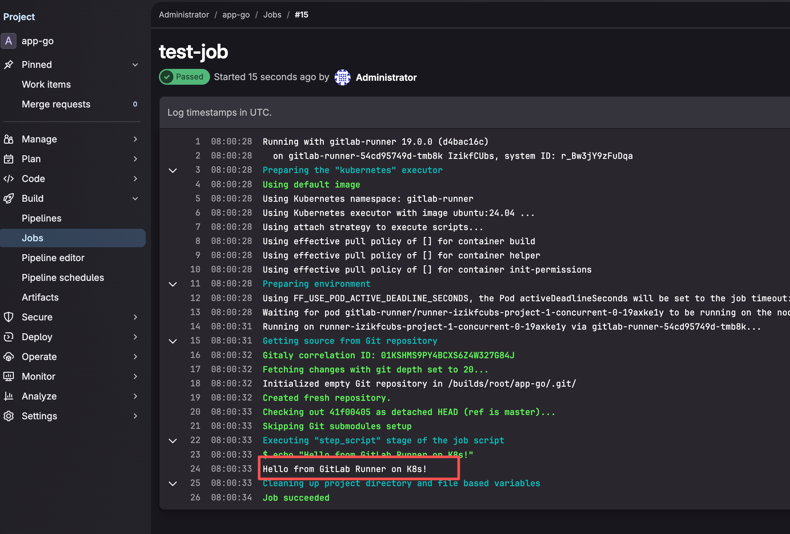
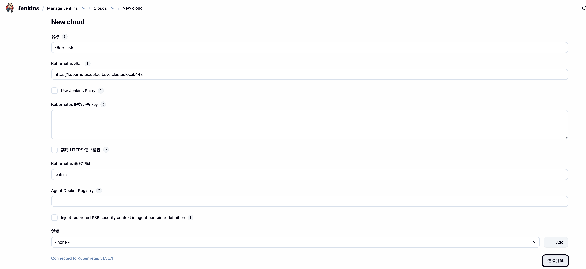
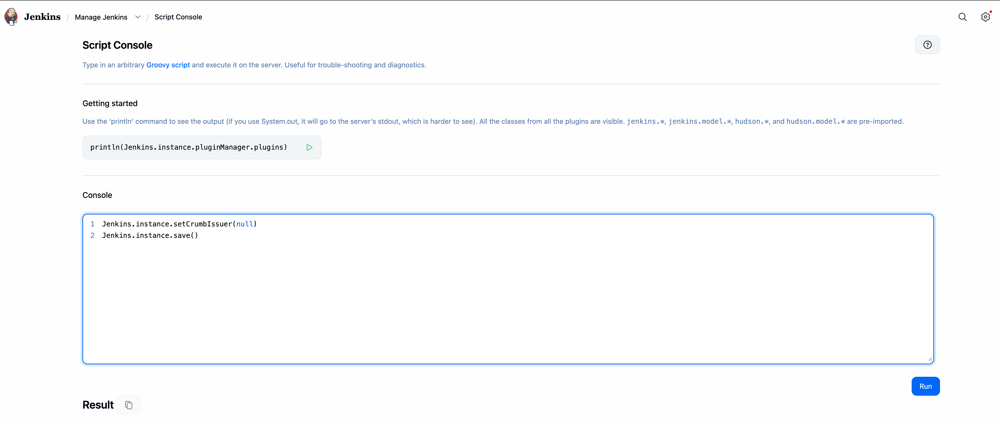
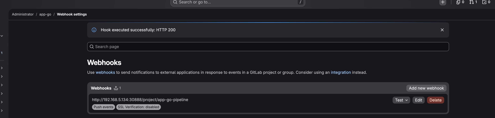

# GitLab + Jenkins CI/CD 部署教程 (单节点 K8s 集群)

> **前置条件：** 已完成 `k8s-ubuntu-singlenode-cluster.md` 教程，Kubernetes v1.36.1 单节点集群运行正常
> **集群节点 IP：** `192.168.5.134`
> **操作系统：** Ubuntu 24.04 LTS (aarch64)
> **文档日期：** 2026年5月26日

---

## 目录

1. [架构概览](#1-架构概览)
2. [部署 GitLab（Docker 方式）](#2-部署-gitlabdocker-方式)
3. [部署 GitLab Runner（K8s 方式）](#3-部署-gitlab-runnerk8s-方式)
4. [部署 Jenkins（K8s Helm 方式）](#4-部署-jenkinsk8s-helm-方式)
5. [配置 Jenkins Kubernetes 插件（动态 Agent）](#5-配置-jenkins-kubernetes-插件动态-agent)
6. [配置 Jenkins RBAC 权限](#6-配置-jenkins-rbac-权限)
7. [配置 GitLab → Jenkins Webhook 集成](#7-配置-gitlab--jenkins-webhook-集成)
8. [编写 Jenkins Pipeline 脚本](#8-编写-jenkins-pipeline-脚本)
9. [端到端验证](#9-端到端验证)
10. [常见问题排查](#10-常见问题排查)
11. [附录：Jenkins Pipeline 完整示例](#11-附录jenkins-pipeline-完整示例)

---

## 1. 架构概览

### 为什么 GitLab 不在 K8s 内部署？

| 方案 | 是否推荐 | 原因 |
|------|---------|------|
| GitLab Helm Chart (K8s 内) | ❌ | 需要 PostgreSQL、Redis、Gitaly 等多个组件，单节点 4-8GB 内存极易 OOM |
| GitLab Docker (宿主机) | ✅ | Omnibus 集成包更高效，避免 K8s 额外开销，稳定可靠 |
| GitLab Runner (K8s 内) | ✅ | CI/CD 任务可按需动态创建 Pod，资源利用率高 |

### 最终架构

```
┌────────────────────────────────────────────────────────────┐
│                     Ubuntu 宿主机 (192.168.5.134)          │
│                                                            │
│  ┌──────────────────┐       ┌──────────────────────────┐   │
│  │   GitLab (Docker) │       │   Kubernetes 集群         │   │
│  │   Port: 8080      │       │                          │   │
│  │                    │       │  ┌──────────────────┐   │   │
│  │   代码仓库         │───────┼─▶│  Jenkins (Helm)   │   │   │
│  │   CI/CD 触发      │       │  │  Port: 30888       │   │   │
│  └──────────────────┘       │  └────────┬─────────┘   │   │
│                              │           │              │   │
│                              │  ┌────────▼─────────┐   │   │
│                              │  │  Jenkins Agent    │   │   │
│                              │  │  (动态 Pod)       │   │   │
│                              │  │  Go/Python/Java   │   │   │
│                              │  └────────┬─────────┘   │   │
│                              │           │              │   │
│                              │  ┌────────▼─────────┐   │   │
│                              │  │  K8s API          │   │   │
│                              │  │  (kubectl apply)  │   │   │
│                              │  └──────────────────┘   │   │
│                              └──────────────────────────┘   │
└────────────────────────────────────────────────────────────┘
```

### 三个微服务端口规划

| 服务 | 语言 | 监听端口 | K8s Service 名 |
|------|------|---------|----------------|
| app-go | Go | 8899 | app-go-service |
| app-py | Python (Flask) | 8898 | app-py-service |
| app-java | Java (Spring Boot) | 8897 | app-java-service |

---

## 2. 部署 GitLab（Docker 方式）

### 2.1 安装 Docker（如未安装）

```bash
# 安装 Docker
curl -fsSL https://get.docker.com | sudo bash

# 创建 docker 组
sudo groupadd docker

# 将当前用户加入 docker 组（避免每次 sudo）
sudo usermod -aG docker $USER

# 重新登录或执行以下命令使组生效
newgrp docker

# 启动docker 服务
sudo systemctl start docker

# 设置开机自启动
sudo systemctl enable docker

# 验证是否启动成功
sudo systemctl status docker

# 验证
docker --version
# 输出示例: Docker version 28.1.1


```

### 2.2 准备 GitLab 数据目录

```bash
# 创建 GitLab 数据持久化目录
sudo mkdir -p /srv/gitlab/{config,logs,data}
```

### 2.3 启动 GitLab 容器

```bash
sudo docker run --detach \
  --hostname 192.168.5.134 \
  --name gitlab \
  --restart always \
  --publish 9999:9999 \
  --publish 8443:443 \
  --publish 8022:22 \
  --volume /srv/gitlab/config:/etc/gitlab \
  --volume /srv/gitlab/logs:/var/log/gitlab \
  --volume /srv/gitlab/data:/var/opt/gitlab \
  --shm-size 256m \
  gitlab/gitlab-ce:latest
  
  
# 修改 external_url
sudo docker exec -it gitlab bash
vi /etc/gitlab/gitlab.rb

external_url 'http://192.168.5.134:9999

gitlab-ctl reconfigure
exit
```

> **说明：**
>
> - `--hostname` 设为集群 IP，后续 Jenkins Webhook 和 Git 克隆都使用此地址
> - Web 访问地址：`http://192.168.5.134:8080`
> - SSH 地址：`ssh://git@192.168.5.134:8022`
> - 首次启动需要 3-5 分钟初始化，可以用 `sudo docker logs -f gitlab` 查看进度


### 2.4 获取初始 root 密码

```bash
# 等待 GitLab 完全启动（约 3-5 分钟）
sudo docker logs -f gitlab
# 看到类似 "GitLab is ready!" 的日志后，获取 root 密码

# 获取初始密码
sudo docker exec gitlab cat /etc/gitlab/initial_root_password

# 输出示例:
# Password: xxxxxxxxxxxxxxxxxxxxxxxxxxxxxxxx
```

### 2.5 访问 GitLab 并完成基础配置

1. 浏览器访问 `http://192.168.5.134:8080`
2. 使用用户名 `root` 和上一步获取的密码登录
3. **⚠️ 首次登录后请立即修改密码**（右上角头像 → Preferences → Password）

### 2.6 创建项目仓库

在 GitLab 中创建以下三个项目（或创建 Group 再创建项目）：

| 项目路径 | 说明 |
|---------|------|
| `root/app-go` | Go 微服务 |
| `root/app-py` | Python 微服务 |
| `root/app-java` | Java 微服务 |

创建方式：点击 `New project` → `Create blank project` → 填写项目名 → `Create project`

### 2.7 将本地代码推送到 GitLab

```bash
# 以 app-go 为例
cd services/app-go

# 初始化 Git 仓库（如果尚未初始化）
git init

# 创建 master 分支
git switch -c master

# 添加远程仓库
git remote add origin http://192.168.5.134:8080/root/app-go.git

# 添加文件并推送
git add .
git commit -m "Initial commit"
git push -u origin master
# 输入用户名 root 和你的 GitLab 密码
```

> 其他两个项目（app-py、app-java）重复相同步骤。

### 2.8 验证 GitLab 正常运行

```bash
# 检查容器状态
sudo docker ps | grep gitlab

# 输出示例:
# CONTAINER ID   IMAGE                     STATUS         PORTS
# abc123def456   gitlab/gitlab-ce:latest   Up 5 minutes   0.0.0.0:8080->80/tcp, ...

# 查看资源占用
sudo docker stats --no-stream gitlab
```

> **预期内存占用：** GitLab 容器约 2-3GB RAM，建议宿主机关闭不必要的服务。

---

## 3. 部署 GitLab Runner（K8s 方式）

GitLab Runner 负责执行 `.gitlab-ci.yml` 中定义的 CI/CD 任务。我们将 Runner 部署到 K8s 内，使其能动态创建 Pod 来执行构建任务。

### 3.1 获取 GitLab Runner 认证 Token（新方式）

> ⚠️ **GitLab 15.6+** 已弃用旧的 Registration Token 注册方式，改用 **Runner Authentication Token**（`glrt-` 开头）。GitLab 17+ 默认禁用旧注册 API。

**操作步骤：**

1. 浏览器访问 `http://192.168.5.134:8080`
2. 进入 GitLab → **Settings** → **CI/CD** → **Runners**（或管理员区域 → CI/CD → Runners）
3. 点击 **Create instance runner**（实例级）或 **Create project runner**（项目级）
4. 填写 Runner 配置：
   - **Tags**（标签）：如 `k8s-runner`，后续 Pipeline 中通过 `tags: ["k8s-runner"]` 指定使用此 Runner
   - **Run untagged jobs**：勾选 ✅（允许运行不带标签的 Job）
5. 点击 **Create runner**。 如果出现跳转打不开页面，打概率是缺少端口号导致的，手动拼上即可。
6. **复制生成的 Authentication Token**（以 `glrt-` 开头），这是唯一能看到它的机会

> **与旧方式的区别：** 以前是 Runner 拿着 Registration Token 去 GitLab 注册；现在是先在 GitLab 创建 Runner 记录，生成 Token，Runner 拿着 Token 认证连接。




### 3.2 安装 GitLab Runner Helm Chart

```bash
# 添加 GitLab Helm 仓库
helm repo add gitlab https://charts.gitlab.io
helm repo update

# 为 Runner 创建命名空间
kubectl create namespace gitlab-runner
```

#### 3.2.1 创建 K8s Secret 存放认证 Token

将上一步获取的 Authentication Token 存入 K8s Secret：

```bash
# 将 <YOUR_GLRT_TOKEN> 替换为实际的 glrt-xxx Token
kubectl create secret generic gitlab-runner-secret \
  --namespace gitlab-runner \
  --from-literal=runner-token=glrt-IzikfCUbsXPmySUWDcuKt286MQp0OjEKdToxCw.01.121di7z9u \
  --from-literal=runner-registration-token=glrt-IzikfCUbsXPmySUWDcuKt286MQp0OjEKdToxCw.01.121di7z9u
```

#### 3.2.2 创建 Helm values.yaml

helper_image = "registry.gitlab.com/gitlab-org/gitlab-runner/gitlab-runner-helper:arm64-v19.0.0"

我的电脑是`macos arm64`创建的虚拟机， 所以需要使用 helper_image 执行 arm64镜像 

```bash
cat << 'EOF' > gitlab-runner-values.yaml
gitlabUrl: http://192.168.5.134:9999

rbac:
  create: true

runners:
  secret: gitlab-runner-secret
  privileged: false
  config: |
    [[runners]]
      [runners.kubernetes]
        image = "ubuntu:24.04"
        namespace = "gitlab-runner"
        poll_timeout = 600
        cpu_limit = "1"
        memory_limit = "1Gi"
        cpu_request = "500m"
        memory_request = "512Mi"
        service_account = "gitlab-runner"
        helper_image = "registry.gitlab.com/gitlab-org/gitlab-runner/gitlab-runner-helper:arm64-v19.0.0"
        [runners.kubernetes.node_selector]
          "kubernetes.io/hostname" = "k8s-master"
EOF
```

> **关键变化：** `runnerRegistrationToken` 字段已被弃用。新方式通过 `secret` 字段引用一个包含 `runner-token` 键的 K8s Secret。

### 3.3 部署 GitLab Runner

```bash
# 安装 GitLab Runner
helm install gitlab-runner gitlab/gitlab-runner \
  --namespace gitlab-runner \
  -f gitlab-runner-values.yaml
  
# 如果部署之后重新修改了 gitlab-runner-values.yaml 内容, 需要重新部署
helm upgrade gitlab-runner gitlab/gitlab-runner \
  --namespace gitlab-runner \
  -f gitlab-runner-values.yaml

kubectl rollout restart deployment/gitlab-runner -n gitlab-runner

# 等 Pod 起来
kubectl get pods -n gitlab-runner -w

```

### 3.4 验证 Runner 部署

```bash
# 查看 Runner Pod
kubectl get pods -n gitlab-runner

# 查看日志确认注册成功
kubectl logs -n gitlab-runner -l app=gitlab-runner
# 成功日志示例：
# "Starting runner..."  "Configuration loaded"  "Listening for jobs"

# 在 GitLab Web UI 中验证：Settings → CI/CD → Runners
# 应能看到刚创建的 Runner 显示为绿色（在线状态）
# 注意：同一个 glrt- Token 可以复用于多个 Runner Pod，GitLab 通过 System ID 区分
```

### 3.5 测试 GitLab CI

在任意项目中创建一个 `.gitlab-ci.yml` 文件验证 Runner 是否正常工作：

把这个文件放在你任意一个项目的根目录（比如 `app-go/`），然后 push 到 GitLab，Runner 就会自动触发。

push 完去 GitLab 项目页面 → 左侧 **Build → Pipelines** 查看是否触发成功.

```yaml
# .gitlab-ci.yml
stages:
  - test

test-job:
  stage: test
  tags:
    - k8s-runner
  script:
    - echo "Hello from GitLab Runner on K8s!"
```

> 如果在创建 Runner 时设置了 Tags，需要在 Job 中通过 `tags: ["k8s-runner"]` 指定，或将 Runner 设为 "Run untagged jobs"。

成功截图：




---

## 4. 部署 Jenkins（K8s Helm 方式）

### 4.1 安装 Helm（如果未安装）

```bash
# 如已安装可跳过此步
curl https://raw.githubusercontent.com/helm/helm/main/scripts/get-helm-3 | bash
helm version
```

### 4.2 添加 Jenkins Helm 仓库并准备配置

```bash
# 添加 Jenkins Helm 仓库
helm repo add jenkinsci https://charts.jenkins.io
helm repo update

# 查看默认 values
helm show values jenkinsci/jenkins > jenkins-default-values.yaml

# 为 Jenkins 创建命名空间
kubectl create namespace jenkins
```

### 4.3 配置 Jenkins values.yaml

```bash
# 单节点集群没有默认的 StorageClass。需要先创建一个本地的 StorageClass 和 PV。
# 创建存储目录
sudo mkdir -p /data/jenkins

# 创建 StorageClass + PV + PVC
cat << 'EOF' | kubectl apply -f -
apiVersion: storage.k8s.io/v1
kind: StorageClass
metadata:
  name: local-storage
provisioner: kubernetes.io/no-provisioner
volumeBindingMode: WaitForFirstConsumer
---
apiVersion: v1
kind: PersistentVolume
metadata:
  name: jenkins-pv
spec:
  capacity:
    storage: 10Gi
  accessModes:
    - ReadWriteOnce
  persistentVolumeReclaimPolicy: Retain
  storageClassName: local-storage
  local:
    path: /data/jenkins
  nodeAffinity:
    required:
      nodeSelectorTerms:
      - matchExpressions:
        - key: kubernetes.io/hostname
          operator: In
          values:
          - k8s-master
EOF
```

```bash
cat << 'EOF' > jenkins-values.yaml
# Jenkins 配置 - 单节点集群优化版
serviceAccount:
  create: true
  name: jenkins

controller:
  image:
    registry: docker.io
    repository: jenkins/jenkins
    tag: "lts-jdk21"                          # 当前 LTS 版本基于 JDK 21
  imagePullPolicy: IfNotPresent

  # 资源限制（单节点集群需严格控制）
  resources:
    requests:
      cpu: "500m"
      memory: "1Gi"
    limits:
      cpu: "1"
      memory: "2Gi"

  # Jenkins 初始化插件列表
  installPlugins: []
  initializeOnce: true

  # 管理员账号配置（新版字段名）
  admin:
    username: admin
    # password: admin123                       # 取消注释可设置固定密码（否则随机生成）

  # 通过 NodePort 对外暴露
  serviceType: NodePort
  servicePort: 8080
  nodePort: 30888                              # 固定 NodePort

  # 存储配置
  storageClass: ""
  storage: 10Gi

  # 自定义 Jenkins URL（用于 GitLab Webhook 回调）
  jenkinsUriPrefix: ""

  # 关闭 CSRF（单节点学习环境，生产环境建议开启）
  disableCSRFProtection: true

# Agent/Executor 配置
# 新版 Helm Chart 要求 image 拆分成 registry/repository/tag 格式
agent:
  enabled: true
  image:
    registry: docker.io
    repository: jenkins/inbound-agent
    tag: "latest-jdk21"
  resources:
    requests:
      cpu: "200m"
      memory: "256Mi"
    limits:
      cpu: "500m"
      memory: "512Mi"

# 持久化配置
persistence:
  enabled: true
  size: 10Gi
  storageClass: local-storage

# 网络配置 - 允许 Jenkins 与 K8s API 通信
rbac:
  create: true
EOF

```

### 4.4 部署 Jenkins

```bash
# 安装 Jenkins
helm install jenkins jenkinsci/jenkins \
  --namespace jenkins \
  -f jenkins-values.yaml
 
# 如果出现 
#  Warning  Failed     37s                kubelet            spec.initContainers{init}: # # Error: ErrImagePull
#  Normal   Pulling    23s (x2 over 41s)  kubelet            spec.initContainers{init}: # # Pulling image "docker.io/jenkins/jenkins:lts-jdk21"
# 
# 网络不稳定导致的。可以使用手动拉取镜像，多尝试几次， 拉取成功后 Pod 会自动恢复，不需要重启
# sudo ctr images pull docker.io/jenkins/jenkins:lts-jdk21
  
  
# 如果有问题需要卸载 
# helm uninstall jenkins -n jenkins

# 查看部署状态
kubectl rollout status statefulset/jenkins -n jenkins

# 查看 Service
kubectl get svc -n jenkins
# 输出示例:
# NAME      TYPE       CLUSTER-IP     EXTERNAL-IP   PORT(S)                       AGE
# jenkins   NodePort   10.96.50.100   <none>        8080:30888/TCP,50000:32222/TCP   2m

#
kubectl get pods -n jenkins
kubectl describe pod jenkins-0 -n jenkins | tail -20
```

### 4.5 获取 Jenkins 初始管理员密码

```bash
# 1. Get your 'admin' user password by running:
kubectl exec --namespace jenkins -it svc/jenkins -c jenkins -- /bin/cat /run/secrets/additional/chart-admin-password && echo
  
  
# 2. Get the Jenkins URL to visit by running these commands in the same shell:

export NODE_PORT=$(kubectl get --namespace jenkins -o jsonpath="{.spec.ports[0].nodePort}" services jenkins)
  export NODE_IP=$(kubectl get nodes --namespace jenkins -o jsonpath="{.items[0].status.addresses[0].address}")
  echo http://$NODE_IP:$NODE_PORT
```

### 4.6 访问 Jenkins

```bash
# 在 Web UI 里逐个安装插件，这样走的是宿主机网络，DNS 没问题。
# 获取 Jenkins 访问地址
echo "Jenkins 地址: http://192.168.5.134:30888"
echo "用户名: admin"
echo "密码: $(kubectl get secret jenkins -n jenkins -o jsonpath='{.data.jenkins-admin-password}' | base64 -d)"
```


#### 给 Jenkins Pod 配置 DNS

```bash
# 先看宿主机的 DNS 是什么
cat /etc/resolv.conf

# 然后在 jenkins-values.yaml 里加上 DNS 配置：
yamlcontroller:
  podDnsConfig:
    nameservers:
      - 8.8.8.8
      - 8.8.4.4
      
# 如
controller:
  image:
    registry: docker.io
    repository: jenkins/jenkins
    tag: "lts-jdk21"                          # 当前 LTS 版本基于 JDK 21
  podDnsConfig:
    nameservers:
      - 8.8.8.8
      - 8.8.4.4
      
  imagePullPolicy: IfNotPresent
  
# 升级
helm upgrade jenkins jenkinsci/jenkins \
  --namespace jenkins \
  -f jenkins-values.yaml
  
kubectl rollout restart statefulset/jenkins -n jenkins
kubectl get pods -n jenkins -w


# 如果还是不行, 改用下面的方式
# 给 CoreDNS 配置转发，让它把外网域名转发给 8.8.8.8
kubectl edit configmap coredns -n kube-system

# 找到 forward . /etc/resolv.conf 这行，改成：
forward . 8.8.8.8 8.8.4.4

# 保存后重启 CoreDNS：
bashkubectl rollout restart deployment/coredns -n kube-system

# 测试, 出现301 则说明重定向成功.
kubectl exec -n jenkins jenkins-0 -c jenkins -- curl -s -o /dev/null -w "%{http_code}" https://updates.jenkins.io/update-center.json

# 跟踪一下重定向, 成功则是 200
ubectl exec -n jenkins jenkins-0 -c jenkins -- curl -L -s -o /dev/null -w "%{http_code}" https://updates.jenkins.io/update-center.json

# 同时去 Jenkins UI 刷新一下：Manage Jenkins → Plugins → 点右上角 Check now 按钮强制刷新更新中心，看看还有没有报错。

```


### 4.7 完成 Jenkins 初始化配置

1. 浏览器访问 `http://192.168.5.134:30888`
2. 使用 `admin` 和上面获取的密码登录
3. 进入 `Manage Jenkins` → `Plugins` → `Available plugins`，确保以下插件已安装：
   - ✅ Kubernetes
   - ✅ Pipeline （搜 workflow-aggregator）
   - ✅ Git
   - ✅ GitLab
   - ✅ Blue Ocean
4. 安装时勾选 **Restart Jenkins when installation is complete**，让 Jenkins 自动重启

---

## 5. 配置 Jenkins Kubernetes 插件（动态 Agent）

Jenkins Kubernetes 插件允许 Jenkins 在运行 Pipeline 时自动在 K8s 集群中创建临时的 Agent Pod，任务完成后自动销毁。

### 5.1 自动配置（通过 Helm values.yaml）

上面的 `jenkins-values.yaml` 中已通过 `installPlugins` 安装了 `kubernetes` 插件，并设置了 `agent` 配置。现在需要在 Jenkins Web UI 中配置 K8s 连接。

### 5.2 配置 Kubernetes Cloud

1. 进入 Jenkins → `Manage Jenkins` → `Clouds`→ `New cloud` →  `Configure Clouds`
2. 点击 `Add a new cloud` → 选择 `Kubernetes`
3. 填写以下配置：

| 配置项 | 值 | 说明 |
|--------|-----|------|
| Name | `k8s-cluster` | 自定义名称 |
| Kubernetes URL | `https://kubernetes.default.svc.cluster.local:443` | K8s 内部 API 地址 |
| Kubernetes Namespace | `jenkins` | Agent Pod 所在的命名空间 |
| Credentials | 留空（使用 ServiceAccount） | 自动使用 Pod 挂载的 Token |
| Jenkins URL | `http://jenkins:8080` | Jenkins 内部服务地址 |

4. 点击 **Test Connection** → 应显示 `Connection test successful`
5. 点击 **Save**




### 5.3 在 Pipeline 中声明式使用 Agent

上一步链接成功。这一步先跳过去，开始下一步。

---

## 6. 配置 Jenkins RBAC 权限

### 6.1 为 Jenkins 创建 ClusterRole 绑定

Jenkins 需要调用 K8s API 来创建/管理 Agent Pod **和** 部署应用。为确保 Jenkins 有足够权限，创建一个 ClusterRoleBinding。

```bash
cat << 'EOF' | kubectl apply -f -
apiVersion: v1
kind: ServiceAccount
metadata:
  name: jenkins
  namespace: jenkins
---
apiVersion: rbac.authorization.k8s.io/v1
kind: ClusterRole
metadata:
  name: jenkins-admin
rules:
- apiGroups: ["*"]
  resources: ["*"]
  verbs: ["*"]
---
apiVersion: rbac.authorization.k8s.io/v1
kind: ClusterRoleBinding
metadata:
  name: jenkins-admin-binding
subjects:
- kind: ServiceAccount
  name: jenkins
  namespace: jenkins
roleRef:
  kind: ClusterRole
  name: jenkins-admin
  apiGroup: rbac.authorization.k8s.io
EOF
```

> **注意：** 以上配置授予了 `cluster-admin` 级别权限。生产环境中建议遵循最小权限原则，只授予特定命名空间的操作权限。

### 6.2 验证 RBAC 权限

```bash
# 测试 Jenkins Pod 是否能正常访问 K8s API
kubectl exec -n jenkins statefulset/jenkins -- cat /var/run/secrets/kubernetes.io/serviceaccount/token | head -c 20
echo ""

# 创建测试 Pod 验证权限（使用 Jenkins 的 ServiceAccount）
kubectl auth can-i create pods --namespace jenkins --as=system:serviceaccount:jenkins:jenkins
# 返回 yes 说明成功
```

---

## 7. 配置 GitLab → Jenkins Webhook 集成

### 7.1 在 Jenkins 中创建 API Token

>  当前安全模式已关闭， 可以跳过。 直接开始 7.2， 在 Gitlab 配置 Webhook 时, Secret Token 留空即可.
>
> 线上建议打开.

1. Jenkins → 右上角点击 `admin` → `Configure`
2. `API Token` → 点击 `Add new Token`
3. 输入名称（如 `gitlab-webhook`）→ 点击 `Generate`
4. **复制生成的 Token**（离开页面后将无法再次查看）

### 7.2 在 Jenkins 中创建 Pipeline 任务

1. Jenkins → `New Item`
2. 输入名称（如 `app-go-pipeline`）
3. 选择 `Pipeline` → `OK`
4. 在 Pipeline 配置页：
   - **General**: 勾选 `GitLab connection`，连接默认即可
   - **Build Triggers**: 勾选 `Build when a change is pushed to GitLab` → 复制显示的 `GitLab Webhook URL`
   - **Pipeline**: 选择 `Pipeline script from SCM`
     - SCM: `Git`
     - Repository URL: `http://192.168.5.134:9999/root/app-go.git`
     - Credentials: 添加 GitLab 凭据（用户名密码）
     - Branches: `*/master`
     - Script Path: `Jenkinsfile`
5. 点击 `Save`

### 7.3 在 GitLab 中配置 Webhook

1. GitLab → 进入 `app-go` 项目 → `Settings` → `Webhooks`

   > http://192.168.5.134:9999/root/app-go/-/hooks

2. 填写：

| 配置项 | 值 |
|--------|-----|
| URL | `http://192.168.5.134:30888/project/app-go-pipeline`（即 Jenkins 上显示的 URL）|
| Secret Token | 上一步生成的 Jenkins API Token,这里为空。 按需配置 |
| Trigger | ✅ Push events（分支选 `master`） |

3. 点击 `Add webhook`
4. 在 Webhook 列表中找到刚创建的 Webhook → 点击 `Test` → `Push events`
5. 如果显示 `Hook executed successfully: HTTP 200`，表示集成成功

>如果报 invalid url 。
>
>GitLab 默认不允许 Webhook 请求发往本地网络地址，需要在 GitLab 里开启这个权限。
>
>去 GitLab Admin area：
>
>```
>http://192.168.5.134:9999/admin/application_settings/network
>```
>
>找到 **Outbound requests** 部分，勾选：
>
>- ✅ **Allow requests to the local network from webhooks and integrations**
>
>点 **Save changes**，然后回来重新添加 Webhook 就可以了。

```bash
# 如果报错:
Hook executed successfully but returned HTTP 403 <html> <head> <meta http-equiv="Content-Type" content="text/html;charset=ISO-8859-1"/> <title>Error 403 No valid crumb was included in the request</title> </head> <body><h2>HTTP ERROR 403 No valid crumb was included in the request</h2> <table> <tr><th>URI:</th><td>/job/app-go-pipeline/</td></tr> <tr><th>STATUS:</th><td>403</td></tr> <tr><th>MESSAGE:</th><td>No valid crumb was included in the request</td></tr> <tr><th>SERVLET:</th><td>Stapler</td></tr> </table> <hr/><a href="https://jetty.org/">Powered by Jetty:// 12.1.8</a><hr/> </body> </html>

# 是 Jenkins 的 CSRF 保护还在生效 .
# 直接在 Jenkins UI 里关掉：
# Manage Jenkins → Security → 找到 CSRF Protection → 取消勾选 Enable proxy
#
# 或者直接访问 http://192.168.5.134:30888/manage/script
# 输入以下代码然后点 Run：
# Jenkins.instance.setCrumbIssuer(null)
# bJenkins.instance.save()
# 然后回 GitLab 重新 Test Push Events。
```







### 7.4 验证 Webhook 触发

```bash
# 在本地修改项目并推送，观察 Jenkins 是否自动触发构建
# 将 8.1 的内容 传到 app-go仓库中

cd services/app-go
echo "# Updated" >> README.md
git add . && git commit -m "test webhook"
git push origin master
```

---

## 8. 编写 Jenkins Pipeline 脚本

### 8.1 创建各项目的 Jenkinsfile

在每个项目的根目录创建 `Jenkinsfile`。

#### app-go/Jenkinsfile

```groovy
pipeline {
    agent {
        kubernetes {
            label 'agent-go'
            yaml """
kind: Pod
spec:
  containers:
  - name: golang
    image: golang:1.24-alpine
    command: ['cat']
    tty: true
  - name: kubectl
    image: bitnami/kubectl:latest
    command: ['cat']
    tty: true
  serviceAccountName: jenkins
  nodeSelector:
    kubernetes.io/hostname: k8s-master
"""
        }
    }

    stages {
        stage('Checkout') {
            steps {
                git url: 'http://192.168.5.134:8080/root/app-go.git',
                    branch: 'master',
                    credentialsId: 'gitlab-credentials'
            }
        }

        stage('Build Go Binary') {
            steps {
                container('golang') {
                    sh 'go build -o app-go .'
                }
            }
        }

        stage('Build Docker Image') {
            steps {
                container('kubectl') {
                    sh 'docker build -t app-go:latest .'
                }
            }
        }

        stage('Deploy to K8s') {
            steps {
                container('kubectl') {
                    sh 'kubectl apply -f k8s/deployment.yaml'
                    sh 'kubectl rollout status deployment/app-go'
                }
            }
        }
    }
}
```

#### app-java/Jenkinsfile

```groovy
pipeline {
    agent {
        kubernetes {
            label 'agent-java'
            yaml """
kind: Pod
spec:
  containers:
  - name: maven
    image: maven:3.9-eclipse-temurin-21-alpine
    command: ['cat']
    tty: true
  - name: kubectl
    image: bitnami/kubectl:latest
    command: ['cat']
    tty: true
  serviceAccountName: jenkins
  nodeSelector:
    kubernetes.io/hostname: k8s-master
"""
        }
    }

    stages {
        stage('Checkout') {
            steps {
                git url: 'http://192.168.5.134:8080/root/app-java.git',
                    branch: 'master',
                    credentialsId: 'gitlab-credentials'
            }
        }

        stage('Build JAR') {
            steps {
                container('maven') {
                    sh './mvnw package -DskipTests'
                }
            }
        }

        stage('Build Docker Image') {
            steps {
                container('kubectl') {
                    sh 'docker build -t app-java:latest .'
                }
            }
        }

        stage('Deploy to K8s') {
            steps {
                container('kubectl') {
                    sh 'kubectl apply -f k8s/deployment.yaml'
                    sh 'kubectl rollout status deployment/app-java --timeout=120s'
                }
            }
        }
    }
}
```

#### app-py/Jenkinsfile

```groovy
pipeline {
    agent {
        kubernetes {
            label 'agent-py'
            yaml """
kind: Pod
spec:
  containers:
  - name: python
    image: python:3.13-alpine
    command: ['cat']
    tty: true
  - name: kubectl
    image: bitnami/kubectl:latest
    command: ['cat']
    tty: true
  serviceAccountName: jenkins
  nodeSelector:
    kubernetes.io/hostname: k8s-master
"""
        }
    }

    stages {
        stage('Checkout') {
            steps {
                git url: 'http://192.168.5.134:8080/root/app-py.git',
                    branch: 'master',
                    credentialsId: 'gitlab-credentials'
            }
        }

        stage('Install Dependencies') {
            steps {
                container('python') {
                    sh 'pip install -r requirements.txt -t .'
                }
            }
        }

        stage('Build Docker Image') {
            steps {
                container('kubectl') {
                    sh 'docker build -t app-py:latest .'
                }
            }
        }

        stage('Deploy to K8s') {
            steps {
                container('kubectl') {
                    sh 'kubectl apply -f k8s/deployment.yaml'
                    sh 'kubectl rollout status deployment/app-py --timeout=60s'
                }
            }
        }
    }
}
```

### 8.2 创建 K8s 部署清单

在每个项目根目录创建 `k8s/` 目录，放置 K8s 部署配置。

#### services/app-go/k8s/deployment.yaml

```yaml
apiVersion: apps/v1
kind: Deployment
metadata:
  name: app-go
  labels:
    app: app-go
spec:
  replicas: 1
  selector:
    matchLabels:
      app: app-go
  template:
    metadata:
      labels:
        app: app-go
    spec:
      containers:
      - name: app-go
        image: app-go:latest
        imagePullPolicy: IfNotPresent
        ports:
        - containerPort: 8899
        resources:
          requests:
            cpu: "100m"
            memory: "128Mi"
          limits:
            cpu: "500m"
            memory: "256Mi"
        livenessProbe:
          httpGet:
            path: /api/health
            port: 8899
          initialDelaySeconds: 5
          periodSeconds: 10
---
apiVersion: v1
kind: Service
metadata:
  name: app-go-service
spec:
  selector:
    app: app-go
  ports:
  - port: 8899
    targetPort: 8899
  type: ClusterIP
```

#### services/app-py/k8s/deployment.yaml

```yaml
apiVersion: apps/v1
kind: Deployment
metadata:
  name: app-py
  labels:
    app: app-py
spec:
  replicas: 1
  selector:
    matchLabels:
      app: app-py
  template:
    metadata:
      labels:
        app: app-py
    spec:
      containers:
      - name: app-py
        image: app-py:latest
        imagePullPolicy: IfNotPresent
        ports:
        - containerPort: 8898
        resources:
          requests:
            cpu: "100m"
            memory: "128Mi"
          limits:
            cpu: "500m"
            memory: "256Mi"
        livenessProbe:
          httpGet:
            path: /api/health
            port: 8898
          initialDelaySeconds: 5
          periodSeconds: 10
---
apiVersion: v1
kind: Service
metadata:
  name: app-py-service
spec:
  selector:
    app: app-py
  ports:
  - port: 8898
    targetPort: 8898
  type: ClusterIP
```

#### services/app-java/k8s/deployment.yaml

```yaml
apiVersion: apps/v1
kind: Deployment
metadata:
  name: app-java
  labels:
    app: app-java
spec:
  replicas: 1
  selector:
    matchLabels:
      app: app-java
  template:
    metadata:
      labels:
        app: app-java
    spec:
      containers:
      - name: app-java
        image: app-java:latest
        imagePullPolicy: IfNotPresent
        ports:
        - containerPort: 8897
        resources:
          requests:
            cpu: "200m"
            memory: "256Mi"
          limits:
            cpu: "1"
            memory: "512Mi"
        livenessProbe:
          httpGet:
            path: /api/health
            port: 8897
          initialDelaySeconds: 10
          periodSeconds: 10
---
apiVersion: v1
kind: Service
metadata:
  name: app-java-service
spec:
  selector:
    app: app-java
  ports:
  - port: 8897
    targetPort: 8897
  type: ClusterIP
```

---

## 9. 端到端验证

### 9.1 验证全部组件状态

```bash
# 1. GitLab 容器运行状态
sudo docker ps | grep gitlab

# 2. GitLab Runner Pod
kubectl get pods -n gitlab-runner

# 3. Jenkins Pod
kubectl get pods -n jenkins

# 4. Jenkins 服务
kubectl get svc -n jenkins
```

### 9.2 端到端 CI/CD 测试流程

```bash
# 1. 在 GitLab 中确认三个仓库已创建并推入代码
#    http://192.168.5.134:8080/root/app-go
#    http://192.168.5.134:8080/root/app-py
#    http://192.168.5.134:8080/root/app-java

# 2. 修改任一项目代码并推送，触发 Webhook
cd services/app-go
echo -e "\n// Trigger CI/CD" >> main.go
git add . && git commit -m "Trigger Jenkins pipeline"
git push origin master

# 3. 在 Jenkins Web UI 中查看 Pipeline 是否自动触发
#    http://192.168.5.134:30888

# 4. 查看构建过程中动态创建的 Agent Pod
kubectl get pods -n jenkins -w
# 应看到类似 jenkins-agent-xxxxx 的临时 Pod 自动创建又自动销毁

# 5. 验证部署结果
kubectl get all -l app=app-go
kubectl get all -l app=app-py
kubectl get all -l app=app-java

# 6. 测试应用是否能正常访问
# 首先创建 NodePort 服务以供测试
kubectl expose deployment app-go --port=8899 --type=NodePort --name=app-go-nodeport

# 或者通过 Pod IP 直接访问
APP_GO_POD=$(kubectl get pod -l app=app-go -o jsonpath='{.items[0].status.podIP}')
echo "app-go Pod IP: $APP_GO_POD"
kubectl run test-curl --image=curlimages/curl:latest --rm -it --restart=Never -- \
  curl -s http://$APP_GO_POD:8899/api/health
```

### 9.3 整体架构验证清单

| 组件 | 验证方式 | 预期结果 |
|------|---------|---------|
| GitLab Web UI | `http://192.168.5.134:8080` | 登录成功，项目可见 |
| GitLab Runner | GitLab UI → Settings → CI/CD → Runners | 绿色在线 |
| Jenkins Web UI | `http://192.168.5.134:30888` | 登录成功 |
| Jenkins K8s Cloud | Jenkins → Manage → Clouds → k8s-cluster | Test Connection 成功 |
| Webhook | 推送代码到 GitLab | Jenkins 自动触发构建 |
| Git clone | Jenkins Pipeline | 成功拉取代码 |
| Go 构建 | Jenkins Pipeline | Binary 编译成功 |
| Python 构建 | Jenkins Pipeline | 依赖安装成功 |
| Java 构建 | Jenkins Pipeline | JAR 打包成功 |
| K8s 部署 | Jenkins Pipeline | Deployment 创建成功 |
| 应用访问 | 从集群内部访问 Service | 返回 HTTP 200 |

---

## 10. 常见问题排查

### 10.1 GitLab 容器无法启动

```bash
# 查看详细日志
sudo docker logs -f gitlab

# 检查端口是否被占用
sudo lsof -i :8080
sudo lsof -i :8443

# 检查磁盘空间
df -h /srv/gitlab

# 重新启动
sudo docker restart gitlab
```

### 10.2 GitLab Runner 认证失败

```bash
# 查看 Runner Pod 日志
kubectl logs -n gitlab-runner -l app=gitlab-runner
# 若看到 "401 Unauthorized" 或 "invalid token"，说明 Token 有问题

# 常见原因：
# 1. Token 错误或已过期 - 在 GitLab UI 中重新创建 Runner 获取新 Token
# 2. GitLab URL 从 Pod 内部不可达

# 验证 GitLab 从 Pod 内部是否能访问
kubectl run test-gitlab --image=curlimages/curl:latest \
  --rm -it --restart=Never -- curl -s http://192.168.5.134:8080

# 更新 Token 后重新部署
# 1. 更新 Secret
kubectl delete secret gitlab-runner-secret -n gitlab-runner
kubectl create secret generic gitlab-runner-secret \
  --namespace gitlab-runner \
  --from-literal=runner-token=<NEW_GLRT_TOKEN>

# 2. 重启 Runner Pod
kubectl delete pod -n gitlab-runner -l app=gitlab-runner
```

> ⚠️ **注意：** 更新 Token 后不需要重新 Helm install，只需更新 Secret 并重启 Pod。
> 旧版 `runnerRegistrationToken` 已废弃，请确保使用 `runner-token`（`glrt-` 开头）而不是旧的 Registration Token。

### 10.3 Jenkins 无法连接 K8s API

```bash
# 验证 ServiceAccount 是否存在
kubectl get sa -n jenkins

# 验证 ClusterRoleBinding
kubectl get clusterrolebinding jenkins-admin-binding

# 从 Jenkins Pod 内部测试 API 访问
kubectl exec -n jenkins deploy/jenkins -- sh -c "
  TOKEN=\$(cat /var/run/secrets/kubernetes.io/serviceaccount/token)
  curl -s -k --header \"Authorization: Bearer \$TOKEN\" \
    https://kubernetes.default.svc.cluster.local/api
"
```

### 10.4 GitLab Webhook 返回 500 或 404

```bash
# 检查 Jenkins 日志
kubectl logs -n jenkins deploy/jenkins | tail -50

# 常见原因：
# 1. Jenkins URL 配置错误 - Jenkins 需要能被 GitLab 访问
#    确保 Jenkins 的 NodePort 服务能从宿主机访问
# 2. API Token 错误 - 重新生成 Token 并更新 Webhook
# 3. 项目名称不匹配 - Webhook URL 中的项目路径需与实际一致

# 验证 Jenkins 是否可达
curl -s -o /dev/null -w "%{http_code}" http://192.168.5.134:30888
# 应返回 200（或 403，说明可达但需要认证）
```

### 10.5 Agent Pod 创建失败

```bash
# 查看 Agent Pod 创建错误
kubectl describe pod -n jenkins -l jenkins/label=agent-go

# 常见原因：资源不足
kubectl describe nodes | grep -A 5 "Allocated resources"

# 检查是否有 PVC 绑定问题
kubectl get pvc -n jenkins

# 手动清理残留的 Agent Pod
kubectl delete pod -n jenkins -l jenkins/label=agent-go
```

### 10.6 应用部署在 K8s 内无法访问

```bash
# 1. 检查 Pod 状态
kubectl get pods -l app=app-go

# 2. 查看日志
kubectl logs -l app=app-go

# 3. 检查 Service
kubectl describe svc app-go-service

# 4. 通过端口转发临时调试
kubectl port-forward svc/app-go-service 8899:8899
# 然后在浏览器或另一个终端访问 http://localhost:8899/api/health
```

### 10.7 构建时 Docker Build 失败（在 Agent Pod 内）

> 在 K8s Pod 内构建 Docker 镜像涉及 Docker-in-Docker（DinD），这在 Pod 内比较复杂。
> 替代方案：

1. **Kaniko**（推荐）- 无需特权模式即可在容器内构建镜像
2. **Buildah** - 无守护进程的镜像构建工具
3. **在宿主机上构建** - 使用 Jenkins Pipeline 中的 SSH 步骤在宿主机执行 docker build

此部分作为高级话题，可根据需要后续补充。

---

## 11. 附录：Jenkins Pipeline 完整示例

### 完整版多服务 Pipeline（在 Jenkins 中创建 Pipeline 时使用）

```groovy
pipeline {
    agent {
        kubernetes {
            label 'multi-service-builder'
            yaml """
kind: Pod
spec:
  containers:
  - name: golang
    image: golang:1.24-alpine
    command: ['cat']
    tty: true
  - name: python
    image: python:3.13-alpine
    command: ['cat']
    tty: true
  - name: java
    image: maven:3.9-eclipse-temurin-21-alpine
    command: ['cat']
    tty: true
  - name: kubectl
    image: bitnami/kubectl:latest
    command: ['cat']
    tty: true
  serviceAccountName: jenkins
  nodeSelector:
    kubernetes.io/hostname: k8s-master
"""
        }
    }

    environment {
        GITLAB_URL = 'http://192.168.5.134:8080'
        GITLAB_CREDENTIALS = credentials('gitlab-credentials')
    }

    stages {
        stage('Checkout All Services') {
            parallel {
                stage('Checkout app-go') {
                    steps {
                        git url: "${GITLAB_URL}/root/app-go.git",
                            branch: 'master',
                            credentialsId: 'gitlab-credentials'
                        stash name: 'app-go', includes: '**/*'
                    }
                }
                stage('Checkout app-py') {
                    steps {
                        git url: "${GITLAB_URL}/root/app-py.git",
                            branch: 'master',
                            credentialsId: 'gitlab-credentials'
                        stash name: 'app-py', includes: '**/*'
                    }
                }
                stage('Checkout app-java') {
                    steps {
                        git url: "${GITLAB_URL}/root/app-java.git",
                            branch: 'master',
                            credentialsId: 'gitlab-credentials'
                        stash name: 'app-java', includes: '**/*'
                    }
                }
            }
        }

        stage('Build All Services') {
            parallel {
                stage('Build Go') {
                    steps {
                        container('golang') {
                            unstash 'app-go'
                            sh 'go build -o app-go .'
                        }
                    }
                }
                stage('Build Python') {
                    steps {
                        container('python') {
                            unstash 'app-py'
                            sh 'pip install -r requirements.txt -t .'
                        }
                    }
                }
                stage('Build Java') {
                    steps {
                        container('java') {
                            unstash 'app-java'
                            sh './mvnw package -DskipTests'
                        }
                    }
                }
            }
        }

        stage('Deploy to K8s') {
            parallel {
                stage('Deploy app-go') {
                    steps {
                        container('kubectl') {
                            unstash 'app-go'
                            sh 'kubectl apply -f k8s/deployment.yaml'
                            sh 'kubectl rollout status deployment/app-go --timeout=60s'
                        }
                    }
                }
                stage('Deploy app-py') {
                    steps {
                        container('kubectl') {
                            unstash 'app-py'
                            sh 'kubectl apply -f k8s/deployment.yaml'
                            sh 'kubectl rollout status deployment/app-py --timeout=60s'
                        }
                    }
                }
                stage('Deploy app-java') {
                    steps {
                        container('kubectl') {
                            unstash 'app-java'
                            sh 'kubectl apply -f k8s/deployment.yaml'
                            sh 'kubectl rollout status deployment/app-java --timeout=120s'
                        }
                    }
                }
            }
        }

        stage('Verify Deployments') {
            steps {
                container('kubectl') {
                    sh '''
                        echo "=== Verification ==="
                        kubectl get pods -l app=app-go
                        kubectl get pods -l app=app-py
                        kubectl get pods -l app=app-java
                        echo "=== All services deployed successfully ==="
                    '''
                }
            }
        }
    }

    post {
        always {
            cleanWs()
        }
        failure {
            slackSend(
                color: '#FF0000',
                message: "Pipeline failed: ${env.JOB_NAME} - ${env.BUILD_URL}"
            )
        }
        success {
            echo "All services built and deployed successfully!"
        }
    }
}
```

---

## 附录 A：需要的文件改动说明

为了让 Jenkins Pipeline 能顺利构建和部署，你需要在各项目中创建以下文件：

### 需要新建的文件（不改动现有文件）

```
services/
├── app-go/
│   ├── ...                # 现有文件不动
│   ├── Jenkinsfile        # 【需新建】Pipeline 脚本
│   └── k8s/
│       └── deployment.yaml # 【需新建】K8s 部署清单
├── app-py/
│   ├── ...                # 现有文件不动
│   ├── Jenkinsfile        # 【需新建】Pipeline 脚本
│   └── k8s/
│       └── deployment.yaml # 【需新建】K8s 部署清单
└── app-java/
    ├── ...                # 现有文件不动
    ├── Jenkinsfile        # 【需新建】Pipeline 脚本
    └── k8s/
        └── deployment.yaml # 【需新建】K8s 部署清单
```

### 现有文件的问题及建议修改

| 文件 | 问题 | 建议修改 |
|------|------|---------|
| `services/app-java/pom.xml` | 依赖使用 `spring-boot-starter-webmvc`（Spring Boot 4.0+ 的新模块），但未包含内嵌 Tomcat | 可能需要补充 `spring-boot-starter-tomcat` 依赖，或直接使用 `spring-boot-starter-web`。建议你在创建 `k8s/deployment.yaml` 后先用 `./mvnw package` 测试能否正常打包成可执行 JAR |
| 三个应用均无 `/api/health` 端点 | 我们在 `deployment.yaml` 中配置了 livenessProbe 指向 `/api/health`，但并非所有应用都有此路由 | 建议在每个应用中添加 `/api/health` 端点返回 200，或调整 `deployment.yaml` 中的存活探针路径 |

---

> **恭喜！** 你现在已经拥有了一个完整的 CI/CD 流水线：
>
> **代码推送 → GitLab → Webhook → Jenkins → K8s Agent Pod → 构建应用 → 部署到 K8s**
>
> 后续可继续扩展：
> - 添加 Ingress Controller 统一入口路由
> - 集成 NFS 或其它持久化存储
> - 配置 Docker Registry（如 Harbor）管理容器镜像
> - 集成 SonarQube 代码质量检查
