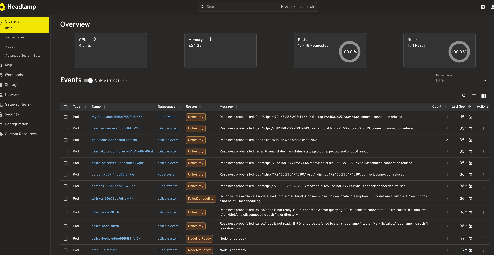
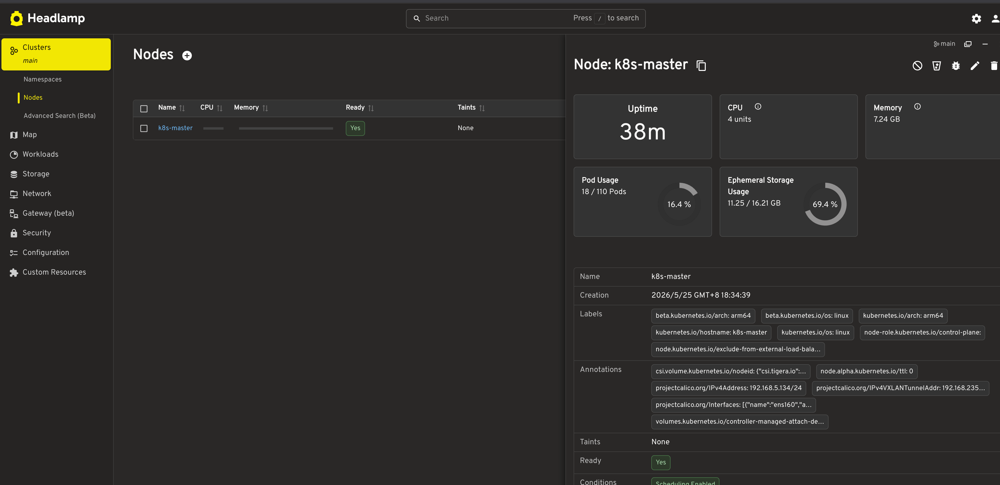
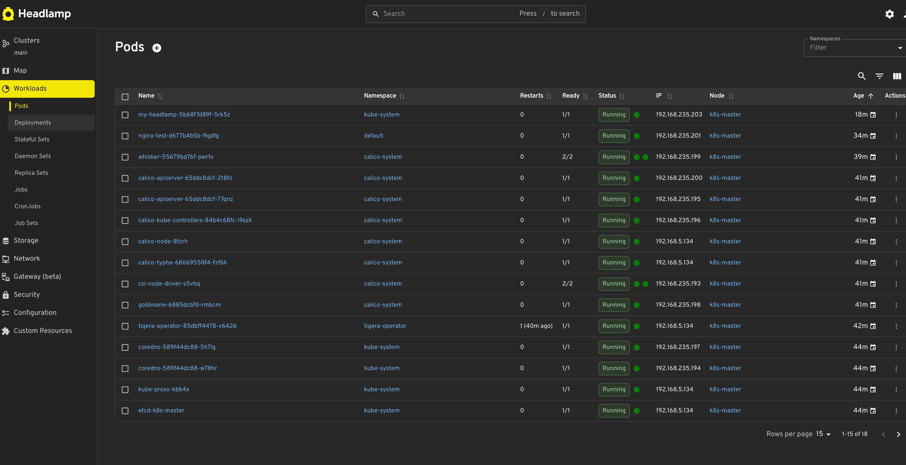

# Kubernetes 单节点集群安装教程 (Ubuntu 24.04.3)

> **适用版本:** Kubernetes v1.36.1 (2026年5月最新稳定版)  
> **操作系统:** Ubuntu 24.04.3 LTS (GNU/Linux 6.8.0-71-generic aarch64)
> **容器运行时:** containerd  
> **CNI 网络插件:** Calico  
> **文档日期:** 2026年5月25日

---

## 目录

1. [环境要求](#1-环境要求)
2. [系统初始化](#2-系统初始化)
3. [安装 containerd](#3-安装-containerd)
4. [安装 kubeadm / kubelet / kubectl](#4-安装-kubeadm--kubelet--kubectl)
5. [初始化 Kubernetes 控制平面](#5-初始化-kubernetes-控制平面)
6. [配置 kubectl](#6-配置-kubectl)
7. [安装 CNI 网络插件 (Calico)](#7-安装-cni-网络插件-calico)
8. [移除控制平面污点 (单节点)](#8-移除控制平面污点-单节点)
9. [验证集群](#9-验证集群)
10. [安装 Kubernetes Dashboard (可选)](#10-安装-kubernetes-dashboard-可选)
11. [常见问题排查](#11-常见问题排查)

---

## 1. 环境要求

| 项目 | 要求 |
|------|------|
| 操作系统 | Ubuntu 22.04 LTS (amd64) |
| CPU | 至少 2 核 |
| 内存 | 至少 2GB (推荐 4GB+) |
| 磁盘 | 至少 20GB 可用空间 |
| 网络 | 公网或内网可访问 apt 仓库 |
| 主机名 | **不能是 `localhost`**（需要可解析的唯一主机名） |

> **⚠️ 重要:** 所有命令均需以 **root 用户** 或使用 `sudo` 执行。以下教程默认使用 `sudo`。

---

## 2. 系统初始化

### 2.1 设置主机名

```bash
# 将 <your-hostname> 替换为你的主机名（例如 k8s-master）
sudo hostnamectl set-hostname k8s-master

# 查看主机名
hostname

# 或者
hostnamectl
```

```bash
 Static hostname: k8s-master
       Icon name: computer-vm
         Chassis: vm 🖴
      Machine ID: de70da75867e4ab78a0a09d5efc361ac
         Boot ID: 9a9dd5ca4109479e9aa7bfb06cbbe109
  Virtualization: vmware
Operating System: Ubuntu 24.04.3 LTS                 
          Kernel: Linux 6.8.0-71-generic
    Architecture: arm64
 Hardware Vendor: VMware, Inc.
  Hardware Model: VMware20,1
Firmware Version: VMW201.00V.24006586.BA64.2406042154
   Firmware Date: Tue 2024-06-04
    Firmware Age: 1y 11month 2w 6d
```


确保 `/etc/hosts` 中有正确的解析：

```bash
echo "127.0.0.1 k8s-master" | sudo tee -a /etc/hosts

# 输出
127.0.0.1 k8s-master
```

### 2.2 禁用 Swap

Kubernetes 要求关闭 swap 才能正常运行。

```bash
# 立即关闭 swap
sudo swapoff -a

# 永久关闭 swap（注释掉 /etc/fstab 中的 swap 行）
sudo sed -i '/ swap / s/^\(.*\)$/#\1/g' /etc/fstab
```

验证 swap 已关闭：

```bash
free -h
# 输出中 Swap 行的 total 应为 0

               total        used        free      shared  buff/cache   available
Mem:           7.2Gi       436Mi       4.6Gi       1.3Mi       2.4Gi       6.8Gi
Swap:             0B          0B          0B
```


### 2.3 加载内核模块

```bash
cat <<EOF | sudo tee /etc/modules-load.d/k8s.conf
overlay
br_netfilter
EOF

# 立即加载
sudo modprobe overlay
sudo modprobe br_netfilter
```

### 2.4 配置内核参数

```bash
cat <<EOF | sudo tee /etc/sysctl.d/k8s.conf
net.bridge.bridge-nf-call-iptables  = 1
net.bridge.bridge-nf-call-ip6tables = 1
net.ipv4.ip_forward                 = 1
EOF

# 立即生效
sudo sysctl --system
```

### 2.5 更新系统包

```bash
sudo apt-get update -y
sudo apt-get upgrade -y
```

---

## 3. 安装 containerd

Kubernetes 自 v1.24 起使用 containerd 作为默认容器运行时（已弃用 Docker）。

### 3.1 安装 containerd 包

#### 方案 A：从 Ubuntu 官方仓库安装（最简，推荐）

```bash
sudo apt-get install -y containerd
```

#### 方案 B：从 Docker 官方仓库安装（版本更新）

如果需要 containerd 的最新版本（例如 v2.x+），可以从 Docker 官方仓库安装：

```bash
# 安装依赖
sudo apt-get install -y ca-certificates curl

# 添加 Docker 官方 GPG 密钥
sudo install -m 0755 -d /etc/apt/keyrings
curl -fsSL https://download.docker.com/linux/ubuntu/gpg | sudo gpg --dearmor -o /etc/apt/keyrings/docker.gpg
sudo chmod a+r /etc/apt/keyrings/docker.gpg

# 添加 Docker APT 仓库
echo \
  "deb [arch=$(dpkg --print-architecture) signed-by=/etc/apt/keyrings/docker.gpg] https://download.docker.com/linux/ubuntu \
  $(lsb_release -cs) stable" | sudo tee /etc/apt/sources.list.d/docker.list > /dev/null

# 安装 containerd
sudo apt-get update -y
sudo apt-get install -y containerd.io
```

> **注意:** 选择一种方案即可(这里选择A)，与 Kubernetes 1.36 配合使用。

### 3.2 配置 containerd

生成默认配置并启用 SystemdCgroup（kubelet 要求）：

```bash
# 创建配置目录
sudo mkdir -p /etc/containerd

# 生成默认配置
containerd config default | sudo tee /etc/containerd/config.toml > /dev/null

# 将 SystemdCgroup 改为 true（确保 cgroup 驱动一致）
sudo sed -i 's/SystemdCgroup = false/SystemdCgroup = true/g' /etc/containerd/config.toml
```

### 3.3 重启 containerd

```bash
sudo systemctl restart containerd
sudo systemctl enable containerd
```

验证 containerd 运行状态：

```bash
sudo systemctl status containerd --no-pager
# 应显示 active (running)
```

---

## 4. 安装 kubeadm / kubelet / kubectl

### 4.1 安装依赖

```bash
sudo apt-get install -y apt-transport-https ca-certificates curl gpg
```

### 4.2 添加 Kubernetes APT 仓库

Kubernetes 官方仓库已迁移至 `pkgs.k8s.io`（旧版 `apt.kubernetes.io` 已废弃）。

```bash
# 创建 keyrings 目录
sudo mkdir -p -m 755 /etc/apt/keyrings

# 添加 GPG 密钥
curl -fsSL https://pkgs.k8s.io/core:/stable:/v1.36/deb/Release.key \
  | sudo gpg --dearmor -o /etc/apt/keyrings/kubernetes-apt-keyring.gpg

# 添加 Kubernetes apt 仓库（版本 v1.36）
echo 'deb [signed-by=/etc/apt/keyrings/kubernetes-apt-keyring.gpg] https://pkgs.k8s.io/core:/stable:/v1.36/deb/ /' \
  | sudo tee /etc/apt/sources.list.d/kubernetes.list
```

### 4.3 安装 kubeadm、kubelet、kubectl

```bash
sudo apt-get update -y
sudo apt-get install -y kubelet kubeadm kubectl

# 锁定版本，防止意外升级
sudo apt-mark hold kubelet kubeadm kubectl
```

验证安装：

```bash
kubeadm version   # 应输出 v1.36.x
kubelet --version # 应输出 v1.36.x
kubectl version --client # 应输出 v1.36.x


# 输出示例
son@son:/etc/apt/keyrings$ kubeadm version && kubelet --version && kubectl version --client
kubeadm version: &version.Info{Major:"1", Minor:"36", EmulationMajor:"", EmulationMinor:"", MinCompatibilityMajor:"", MinCompatibilityMinor:"", GitVersion:"v1.36.1", GitCommit:"756939600b9a7180fc2df6550a4585b638875e67", GitTreeState:"clean", BuildDate:"2026-05-12T09:53:52Z", GoVersion:"go1.26.2", Compiler:"gc", Platform:"linux/arm64"}
Kubernetes v1.36.1
Client Version: v1.36.1
Kustomize Version: v5.8.1
```

### 4.4 启用 kubelet（但暂不启动）

```bash
sudo systemctl enable --now kubelet
```

> ⚠️ kubelet 当前会反复重启，这是正常现象，它会在 `kubeadm init` 后稳定运行。

---

## 5. 初始化 Kubernetes 控制平面

### 5.1 拉取所需镜像

```bash
sudo kubeadm config images pull
```

### 5.2 执行初始化

```bash
sudo kubeadm init --pod-network-cidr=192.168.0.0/16 --apiserver-advertise-address=192.168.5.134

# sudo kubeadm init \
#  --pod-network-cidr=192.168.0.0/16 \  # 不要改 
#  --apiserver-advertise-address=192.168.5.134  # 告诉 kubeadm 把 API Server 绑定到你的这张内网卡上, kubectl和未来的工作节点才能通信
```

> **说明:**
>
> - `--pod-network-cidr=192.168.0.0/16` 必须与 Calico 的默认 Pod 网段一致（Calico 的 `custom-resources.yaml` 中默认也是此网段）。如果你修改了其中一个，另一个必须同步修改。
>
> - 如果你的机器有**多个网络接口**（例如 VM 同时有 NAT 和 Host-Only 网卡），建议指定 `--apiserver-advertise-address` 参数，让 API Server 绑定正确的 IP：
>
>   ```bash
>   sudo kubeadm init \
>     --pod-network-cidr=192.168.0.0/16 \
>     --apiserver-advertise-address=192.168.x.x  # 替换为你的实际内网 IP
>   ```
>
>   查看本机 IP：`ip addr show | grep 'inet ' | awk '{print $2}'`
>   
>   我的结果:
>   
>   127.0.0.1/8
>   192.168.5.134/24


### 5.3 初始化成功后的输出

初始化成功后，你会看到类似如下的输出：

```
Your Kubernetes control-plane has been initialized successfully!

To start using your cluster, you need to run the following as a regular user:

  mkdir -p $HOME/.kube
  sudo cp -i /etc/kubernetes/admin.conf $HOME/.kube/config
  sudo chown $(id -u):$(id -g) $HOME/.kube/config

Alternatively, if you are the root user, you can run:

  export KUBECONFIG=/etc/kubernetes/admin.conf

You should now deploy a pod network to the cluster.
Run "kubectl apply -f [podnetwork].yaml" with one of the options listed at:
  https://kubernetes.io/docs/concepts/cluster-administration/addons/
```

**请务必保存输出中的 `kubeadm join` 命令**，如果将来需要向集群添加其他节点时会用到。例如：

```
kubeadm join 192.168.x.x:6443 --token xxxxx --discovery-token-ca-cert-hash sha256:xxxxx

# 示例
kubeadm join 192.168.5.134:6443 --token 051fn7.m7woc964szp5muss \
        --discovery-token-ca-cert-hash sha256:663939f1e1f79ea73252c6116df7db7aee9d97e84e5f0f93756300318c6dea56
```

---

## 6. 配置 kubectl

按照 `kubeadm init` 输出中的提示，为当前用户配置 kubectl：

```bash
mkdir -p $HOME/.kube
sudo cp -i /etc/kubernetes/admin.conf $HOME/.kube/config
sudo chown $(id -u):$(id -g) $HOME/.kube/config
```

验证 kubectl 能否正常访问集群：

```bash
kubectl get nodes
# 输出:
# NAME          STATUS     ROLES           AGE   VERSION
# k8s-master    NotReady   control-plane   30s   v1.36.1
```

> ⚠️ 此时节点状态为 `NotReady`，这是正常的，因为还未安装 CNI 网络插件。

---

## 7. 安装 CNI 网络插件 (Calico)

本教程使用 **Calico** 作为 CNI 网络插件。Calico 是目前最成熟、功能最丰富的 Kubernetes 网络方案之一。

> **版本说明:** 以下使用 Calico v3.32.0（2026年4月30日发布），已确认兼容 Kubernetes 1.36。

### 7.1 通过 Tigera Operator 安装 Calico

```bash
# 安装 Tigera Operator
kubectl create -f https://raw.githubusercontent.com/projectcalico/calico/v3.32.0/manifests/tigera-operator.yaml
```

### 7.2 创建 Calico 自定义资源

```bash
kubectl create -f https://raw.githubusercontent.com/projectcalico/calico/v3.32.0/manifests/custom-resources.yaml
```

### 7.3 等待 Calico Pod 就绪

```bash
# 监视 Calico 相关 Pod 的状态
kubectl get pods -n calico-system --watch
```

等待所有 Pod 状态变为 `Running`（通常需要 2-5 分钟）。按 `Ctrl+C` 退出 watch。

```bash
# 示例
son@son:~$ kubectl get pods -n calico-system --watch
NAME                                      READY   STATUS    RESTARTS   AGE
calico-apiserver-65ddc8dcf-2t8hl          1/1     Running   0          4m6s
calico-apiserver-65ddc8dcf-77qnz          1/1     Running   0          4m6s
calico-kube-controllers-84b4c68fc-l9szk   1/1     Running   0          4m6s
calico-node-8fzrh                         1/1     Running   0          4m6s
calico-typha-68669558f4-fzf6k             1/1     Running   0          4m6s
csi-node-driver-s5vhq                     2/2     Running   0          4m6s
goldmane-6885dcb7d-rmbcm                  1/1     Running   0          4m6s
whisker-55679bd76f-pwrtv                  2/2     Running   0          2m5s
```


### 7.4 验证节点状态

```bash
kubectl get nodes
# 节点状态应从 NotReady 变为 Ready

# 示例
son@son:~$ kubectl get nodes
NAME         STATUS   ROLES           AGE     VERSION
k8s-master   Ready    control-plane   7m37s   v1.36.1
```

---

## 8. 移除控制平面污点 (单节点)

默认情况下，控制平面节点（master）有 `NoSchedule` 污点，普通 Pod 不会被调度到该节点上。**单节点集群需要移除这个污点**，才能在此节点上运行普通工作负载。

### 8.1 查看当前污点

```bash
kubectl describe node $(hostname) | grep Taints
# 输出: Taints: node-role.kubernetes.io/control-plane:NoSchedule
```

### 8.2 移除污点

```bash
kubectl taint nodes $(hostname) node-role.kubernetes.io/control-plane:NoSchedule-

# 示例
son@son:~$ kubectl taint nodes $(hostname) node-role.kubernetes.io/control-plane:NoSchedule-
node/k8s-master untainted
```

### 8.3 验证污点已移除

```bash
kubectl describe node $(hostname) | grep Taints
# 输出: Taints: <none>

# 示例
son@son:~$ kubectl describe node $(hostname) | grep Taints
Taints:             <none>
```

---

## 9. 验证集群

### 9.1 检查所有系统 Pod

```bash
kubectl get pods -n kube-system
kubectl get pods -n calico-system
# 所有 Pod 都应为 Running 状态

# 示例
son@son:~$ kubectl get pods -n kube-system
kubectl get pods -n calico-system
NAME                                 READY   STATUS    RESTARTS        AGE
coredns-589f44dc88-5h7lg             1/1     Running   0               9m59s
coredns-589f44dc88-w78hr             1/1     Running   0               9m59s
etcd-k8s-master                      1/1     Running   0               10m
kube-apiserver-k8s-master            1/1     Running   0               10m
kube-controller-manager-k8s-master   1/1     Running   1 (6m28s ago)   10m
kube-proxy-kbb4x                     1/1     Running   0               9m59s
kube-scheduler-k8s-master            1/1     Running   1 (6m8s ago)    10m
NAME                                      READY   STATUS    RESTARTS   AGE
calico-apiserver-65ddc8dcf-2t8hl          1/1     Running   0          7m7s
calico-apiserver-65ddc8dcf-77qnz          1/1     Running   0          7m7s
calico-kube-controllers-84b4c68fc-l9szk   1/1     Running   0          7m7s
calico-node-8fzrh                         1/1     Running   0          7m7s
calico-typha-68669558f4-fzf6k             1/1     Running   0          7m7s
csi-node-driver-s5vhq                     2/2     Running   0          7m7s
goldmane-6885dcb7d-rmbcm                  1/1     Running   0          7m7s
whisker-55679bd76f-pwrtv                  2/2     Running   0          5m6s
```

### 9.2 部署一个测试应用

```bash
# 创建测试 deployment
kubectl create deployment nginx-test --image=nginx:latest

# 暴露为 NodePort 服务
kubectl expose deployment nginx-test --port=80 --type=NodePort

# 查看服务端口
kubectl get svc nginx-test


# 示例
son@son:~$ kubectl create deployment nginx-test --image=nginx:latest
deployment.apps/nginx-test created
son@son:~$ kubectl expose deployment nginx-test --port=80 --type=NodePort
service/nginx-test exposed
son@son:~$ kubectl get svc nginx-test
NAME         TYPE       CLUSTER-IP     EXTERNAL-IP   PORT(S)        AGE
nginx-test   NodePort   10.96.83.141   <none>        80:31252/TCP   5s
```

### 9.3 验证 Pod 正常运行

```bash
# 查看 Pod 状态（应显示 Running）
kubectl get pods -l app=nginx-test

# 测试内部网络通信
kubectl run test-pod --image=busybox:latest --rm -it --restart=Never -- wget -qO- http://nginx-test
# 应输出 nginx 的 HTML 内容


# 示例
son@son:~$ kubectl get pods -l app=nginx-test
NAME                         READY   STATUS    RESTARTS   AGE
nginx-test-d677b4b5b-9gdfg   1/1     Running   0          40s
son@son:~$ kubectl run test-pod --image=busybox:latest --rm -it --restart=Never -- wget -qO- http://nginx-test
<!DOCTYPE html>
<html>
<head>
<title>Welcome to nginx!</title>
<style>
html { color-scheme: light dark; }
body { width: 35em; margin: 0 auto;
font-family: Tahoma, Verdana, Arial, sans-serif; }
</style>
</head>
<body>
<h1>Welcome to nginx!</h1>
<p>If you see this page, nginx is successfully installed and working.
Further configuration is required for the web server, reverse proxy, 
API gateway, load balancer, content cache, or other features.</p>

<p>For online documentation and support please refer to
<a href="https://nginx.org/">nginx.org</a>.<br/>
To engage with the community please visit
<a href="https://community.nginx.org/">community.nginx.org</a>.<br/>
For enterprise grade support, professional services, additional 
security features and capabilities please refer to
<a href="https://f5.com/nginx">f5.com/nginx</a>.</p>

<p><em>Thank you for using nginx.</em></p>
</body>
</html>
All commands and output from this session will be recorded in container logs, including credentials and sensitive information passed through the command prompt.
If you don't see a command prompt, try pressing enter.
Session ended, resume using 'kubectl attach test-pod -c test-pod -n default -i -t' command
pod "test-pod" deleted from default namespace
```

### 9.4 节点完整状态

```bash
kubectl get nodes -o wide
# 所有节点状态应为 Ready
# 应显示正确的 Kubernetes 版本、OS/Arch、容器运行时版本

# 示例
son@son:~$ kubectl get nodes -o wide
NAME         STATUS   ROLES           AGE   VERSION   INTERNAL-IP     EXTERNAL-IP   OS-IMAGE             KERNEL-VERSION             CONTAINER-RUNTIME
k8s-master   Ready    control-plane   12m   v1.36.1   192.168.5.134   <none>        Ubuntu 24.04.4 LTS   6.8.0-71-generic (arm64)   containerd://2.2.1
```

### 9.5 集群健康检查

```bash
# 检查 kube-system 命名空间所有核心 Pod 是否 Running
kubectl get pods -n kube-system
# 应全部为 Running 状态

# 检查 API 资源是否正常
kubectl api-resources | head -20

# 查看集群信息
kubectl cluster-info
```

> **说明:** `kubectl get componentstatuses` 在较新版本的 Kubernetes 中已不可用，请使用上面的替代命令。

---

## 10. 安装 Web Dashboard (可选)

> ⚠️ **注意:** Kubernetes 官方 Dashboard 项目已于 **2026年1月21日** 归档（不再维护）。推荐使用 **Headlamp** 作为替代方案。

### 10.1 安装 Headlamp（推荐）

Headlamp 是 Kubernetes 官方推荐的 Web UI，界面现代且功能完整。

>注意: 由于 Headlamp 已移至 Kubernetes SIG UI 下，Headlamp 的主仓库可在 https://github.com/kubernetes-sigs/headlamp 找到。

```bash
# 安装 Helm 
curl https://raw.githubusercontent.com/helm/helm/main/scripts/get-helm-3 | bash

# 查看 Helm 是否安装成功
son@son:~$ helm version
version.BuildInfo{Version:"v3.21.0", GitCommit:"e0878d41b711792be60777fd65ad23a101e6b85f", GitTreeState:"clean", GoVersion:"go1.25.10"}

# 使用 Helm 安装 Headlamp
helm repo add headlamp https://kubernetes-sigs.github.io/headlamp/
helm install my-headlamp headlamp/headlamp --namespace kube-system

# 示例
son@son:~$ helm repo add headlamp https://kubernetes-sigs.github.io/headlamp/
helm install my-headlamp headlamp/headlamp --namespace kube-system
"headlamp" has been added to your repositories
NAME: my-headlamp
LAST DEPLOYED: Mon May 25 11:00:46 2026
NAMESPACE: kube-system
STATUS: deployed
REVISION: 1
TEST SUITE: None
NOTES:
1. Get the application URL by running these commands:
  export POD_NAME=$(kubectl get pods --namespace kube-system -l "app.kubernetes.io/name=headlamp,app.kubernetes.io/instance=my-headlamp" -o jsonpath="{.items[0].metadata.name}")
  export CONTAINER_PORT=$(kubectl get pod --namespace kube-system $POD_NAME -o jsonpath="{.spec.containers[0].ports[0].containerPort}")
  echo "Visit http://127.0.0.1:8080 to use your application"
  kubectl --namespace kube-system port-forward $POD_NAME 8080:$CONTAINER_PORT
2. Get the token using
  kubectl create token my-headlamp --namespace kube-system
  
 # 查看
kubectl get svc -n kube-system | grep headlamp

# 输出
my-headlamp   ClusterIP   10.97.122.66   <none>        80/TCP                   4m21s
```

### 10.2 访问 Headlamp

```bash
# 将 Headlamp 服务暴露为 NodePort
kubectl patch svc my-headlamp -n kube-system -p '{"spec": {"type": "NodePort"}}'

# 获取访问端口
NODE_PORT=$(kubectl get svc my-headlamp -n kube-system -o jsonpath='{.spec.ports[0].nodePort}')
echo "Headlamp 访问地址: http://$(hostname -I | awk '{print $1}'):$NODE_PORT"

# 输出
# Headlamp 访问地址: http://192.168.5.134:31527
```

然后在浏览器中打开输出的地址即可使用。Headlamp 支持通过 kubeconfig 文件或 service account token 登录。


### 10.3 生成 id token

Headlamp 默认需要创建一个 ServiceAccount 并获取其 Token 来登录.

```bash
kubectl create serviceaccount headlamp-admin -n kube-system && \
kubectl create clusterrolebinding headlamp-admin-binding --clusterrole=cluster-admin --serviceaccount=kube-system:headlamp-admin && \
kubectl create token headlamp-admin -n kube-system
```

复制生成的 token 直接粘贴到浏览器登录.

效果展示：








---

## 11. 常见问题排查

### 11.1 Node 状态一直为 NotReady

```bash
# 查看节点详情
kubectl describe node k8s-master

# 查看 kubelet 日志
sudo journalctl -u kubelet -f

# 确保 CNI 插件已正确安装
kubectl get pods -n calico-system

# 检查 containerd 是否正确配置 SystemdCgroup
sudo cat /etc/containerd/config.toml | grep SystemdCgroup
# 应输出: SystemdCgroup = true
```

### 11.2 kubeadm init 失败

```bash
# 清理失败的安装
sudo kubeadm reset -f
sudo rm -rf /etc/cni/net.d
sudo rm -rf $HOME/.kube/config
sudo rm -rf /etc/kubernetes/

# 然后重新从第 5 节开始
```

### 11.3 Pod 一直处于 Pending 状态

最可能的原因是控制平面污点未移除或 CNI 未安装：

```bash
# 检查污点
kubectl describe node k8s-master | grep Taints

# 检查是否有节点资源不足
kubectl describe pod <pod-name> | grep -A 5 Events
```

### 11.4 Docker 相关错误

Kubernetes 自 v1.24 起已弃用 Docker 作为容器运行时，本教程使用 containerd，这是当前的标准方案。如果遇到任何 dockershim 相关错误，说明你使用了过时的配置。

### 11.5 端口被防火墙阻止

如果使用了 UFW 或 iptables 防火墙，确保放行以下端口：

```bash
# Kubernetes API 服务器
sudo ufw allow 6443/tcp
# etcd 客户端通信
sudo ufw allow 2379:2380/tcp
# Kubelet API
sudo ufw allow 10250/tcp
# 节点间通信
sudo ufw allow 10259/tcp
sudo ufw allow 10257/tcp
```

---

## 附录

### A. 常用命令速查

```bash
# 查看节点
kubectl get nodes -o wide

# 查看所有 Pod
kubectl get pods -A

# 查看所有 Service
kubectl get svc -A

# 查看日志
kubectl logs <pod-name> -n <namespace>

# 进入 Pod
kubectl exec -it <pod-name> -- /bin/bash

# 查看集群信息
kubectl cluster-info

# 查看配置
kubectl config view
```

### B. 重置集群

如果一切搞砸了，想从头开始：

```bash
sudo kubeadm reset -f
sudo rm -rf /etc/cni/net.d
sudo rm -rf $HOME/.kube
sudo rm -rf /etc/kubernetes/
sudo apt-get purge -y kubelet kubeadm kubectl containerd
sudo apt-get autoremove -y
# 重启后重新按照本教程安装
```

---

> **恭喜！** 你现在拥有一个运行在 Ubuntu 24.04.3 上的 Kubernetes v1.36 单节点集群。
>
> 如需进一步了解，请参考官方文档：
> - [Kubernetes 官方文档](https://kubernetes.io/docs/home/)
> - [kubeadm 安装指南](https://kubernetes.io/docs/setup/production-environment/tools/kubeadm/)
> - [Calico 文档](https://docs.tigera.io/calico/latest/)
> - [Headlamp Dashboard](https://headlamp.dev/)
